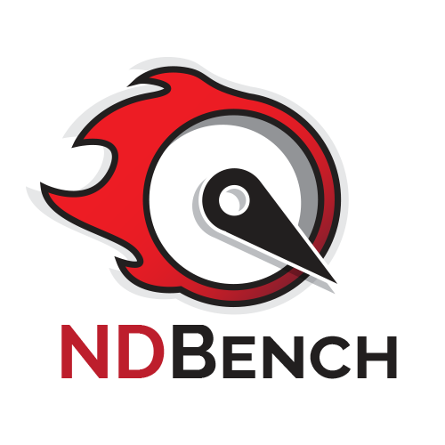

# NdBench

**Netflix Data Benchmark (NDBench)** is a pluggable cloud-enabled benchmarking tool that can be used across any data store system. NDBench provides plugin support for several data stores and can be extended to other client APIs.

## Client APIs
* Apache Cassandra (Thrift and CQL)
* Redis
* Elasticsearch
* Elassandra
* Amazon DynamoDB
* Apache Geode
* Apache JanusGraph
* Netflix Dynomite (Redis API)
* Netflix EVCache (Memcache API)

## Features
   * Dynamically change the benchmark configurations while the test is running, hence perform tests along with our production microservices.
   * Be able to integrate with platform cloud services such as dynamic configurations, discovery, metrics, etc.
   * Run for an infinite duration in order to introduce failure scenarios and test long running maintenances such as database repairs.
   * Provide pluggable patterns and loads.
   * Support different client APIs.
   * Deploy, manage and monitor multiple instances from a single entry point.
   * Support multiple cloud platform due to integration with Cloud Foundry

Details about the features can be found in the [Wiki](https://github.com/Netflix/ndbench/wiki)

## Workflow

The stable version of NdBench is the [master]( https://github.com/Netflix/ndbench/tree/master ) branch.

For questions or contributions, please consider reading [CONTRIBUTING.md](CONTRIBUTING.md).

## Build

NdBench comes with a Gradle wrapper

    ./gradlew build

The gradlew script will pull down all necessary gradle components/infrastructure automatically, then run the build.

NdBench provides several default implementations ( NdBenchConfiguration, LocalClusterDiscovery etc). You can use these or choose to create your own. NdBench currently works on AWS or your local environment. We are open to contributions to support other platforms as well.

## How to

The first step before building ndbench is to configure the interfaces related to your environment in the [InjectedWebListener](https://github.com/Netflix/ndbench/blob/master/ndbench-web/src/main/java/com/netflix/ndbench/defaultimpl/InjectedWebListener.java). Checkout the [Wiki](https://github.com/Netflix/ndbench/wiki/Configuration) for further explanation on what interfaces to bind based on your environment. 

1. Build ndbench
2. Set up Auto-Scale Group (ASG) and spin up instances
3. Deploy `ndbench-web.war` in your container

#### Deploy to Cloud Platforms

`DISCOVERY_ENV` environment variable is responsible to bind the proper Cluster Discovery. Currently AWS, CF and Local are supported.
Hence set the environment variable `DISCOVERY_ENV` based on the environment you are deploying the app. 
For Amazon Web Services use `AWS`, for Cloud Foundry use `CF`, and for local deployments any other name.
For Cloud Foundry, build and upload the ndbench war to CF using `cf push`.

## Run
    ./gradlew appRun

## Configuration

You can provide properties by using ndbench{version}.jar in your web container and then implementing [IConfiguration Interface](https://github.com/Netflix/ndbench/blob/master/ndbench-core/src/main/java/com/netflix/ndbench/core/config/IConfiguration.java). More details on the how the configuration can be found in the [Wiki](https://github.com/Netflix/ndbench/wiki/Configuration).

## Help

Need some help with either getting up and going or some problems with the code?

   * Submit a Github [issue](https://github.com/Netflix/ndbench/issues)
   * Chat with us on 

## License

Licensed under the Apache License, Version 2.0: http://www.apache.org/licenses/LICENSE-2.0
